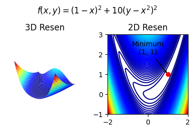

# Mathematical optimization: finding minima of functions.

`scipy`의 `scipy.optimize` 라이브러리는 매우 강력하며 쓸모가 많지만 너무 많은 종류의 알고리즘을 제공하기 때문에 해당 내용을 정리한 문서입니다. 기본적으로 `scipy.optimize.minimize`에 대한 설명이며 중급자 이상을 대상으로 작성되었습니다.

회사에서 업무하며 정리된 자료이며 지속적인 업데이트가 될 수 있습니다.

---
**References**

아래 2개 사이트에서 많은 영감을 받았습니다.

- [공학자를 위한 Python](https://wikidocs.net/15656) : 위키 독스에서 제공된 사이트
- [scipy-lecture](https://scipy-lectures.org/advanced/mathematical_optimization/index.html#mathematical-optimization) : Python으로 수학 및 과학 데이터를 처리하는 방법이 정리된 사이트

---

<!-- ## 목차
[1. 어떤 알고리즘을 선택할 것인가?](#어떤-알고리즘을-선택할-것인가) -->

## 최적화 가이드

위 레퍼런스 중에 어떤 알고리즘을 적용할지 추천한 챕터가 있습니다.

- Gradient를 모를 경우 : BFGS, L-BFGS, Powell, Nelder-Mead
- Gradient를 알 경우 : BFGS, L-BFGS
- Hessian을 계산 할 수 있는 경우 : Newton-CG, TCG
- Noise가 심한 경우 : Nelder-Mead, Powell

결론만 말하면 jaccobian과 hessian을 계산하는 것은 매우 피곤한 일이지만,
자동으로 계산해주는 라이브러리가 존재합니다. 그러므로 어떠한 알고리즘을
선택해도 상관 없습니다. 또한 bounds, constraints를 둘 다 지원하는 함수가 좋습니다. 
그렇다면 일반적으로 SLSQP를 사용하면 됩니다.

대부분의 알고리즘이 비교적 간단한 문제는 대부분 잘 풀고 성능 차이도
그렇게 크지 않습니다. 그러므로 어떤 방법으로 문제를 해결하는지
확인하고 결정하면 됩니다.

## 수학적 최적화 예제 : Rosenbrock 함수

Rosenbrock 함수는 보통 최적화 예제를 풀 때 사용하는 함수이며 다음과 같은 원형입니다.

$$
f(x,y) = (a-x)^2 + b(y-x^2)^2
$$

`scipy.optimize.rosen`으로 얻을 수 있는 함수는 위 함수에 $a=1$, $b=100$ 형태이고, 이 함수가 눈으로 보여주기 다소 번거로운 면이 있어 이를 편의상 $a=1$, $b=10$으로 설정한 함수를 제작하여 사용하였습니다. 또한 `pytorch`에서 제공하는 autograd 기능을 활용하여 jacobian, hessian을 계산하였습니다.

<center>

[](./src/rosenbrock_draw.py "코드 보기")

Rosenbrock 함수 모양
</center>

```python
import torch
from torch.autograd.functional import hessian, jacobian

def full_rosen(data: tuple[float, float], a: float, b: float) -> float:
    x = data[0]
    y = data[1]
    return (a-x)**2 + b*(y-x**2)**2

def rosen(x): return full_rosen(x, a=1, b=10)
def jac(x): return jacobian(rosen, torch.Tensor(x)).numpy()
def hess(x): return hessian(rosen, torch.Tensor(x)).numpy()
```
<center>jacobian, hessian 예제</center>

<br>

### 최적화 알고리즘 적용 결과

